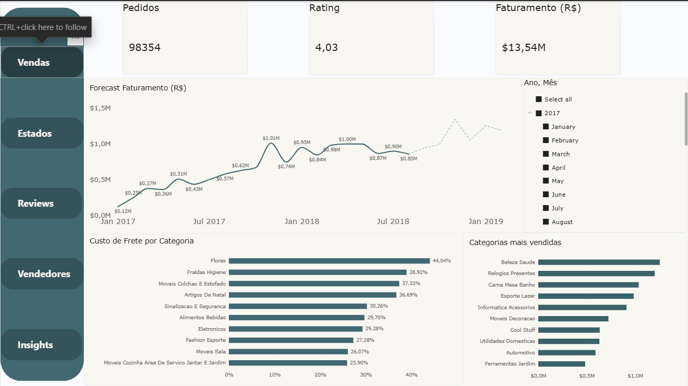
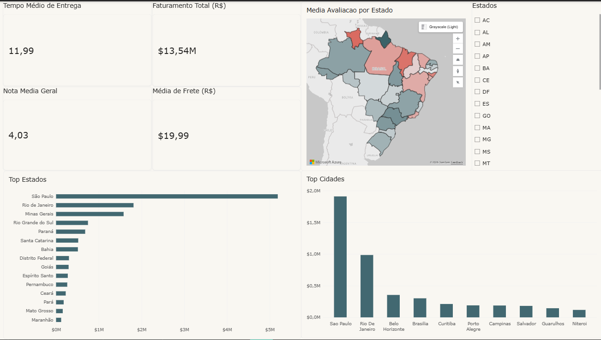
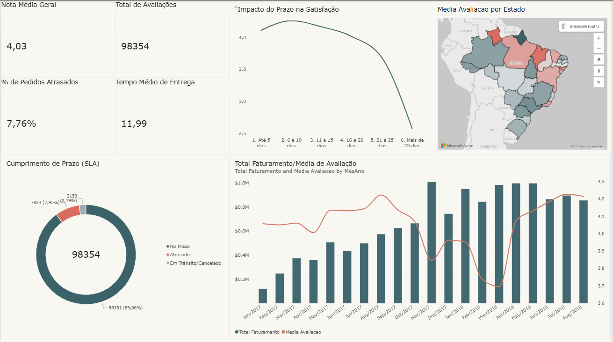
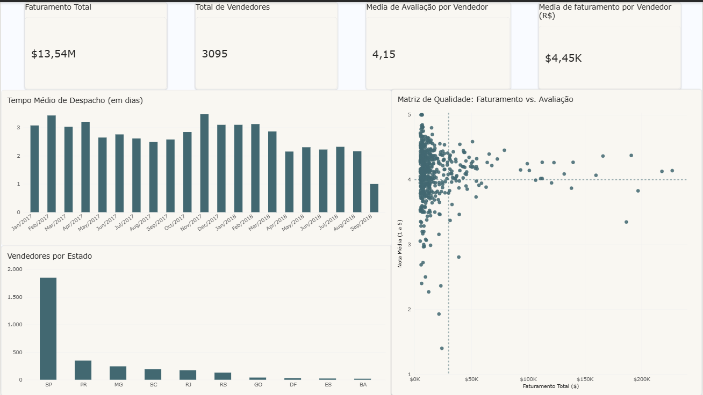

#  Olist E-commerce: Pipeline de Dados & Analytics

Este é um projeto prático focado em engenharia de dados e business intelligence. O objetivo foi criar um pipeline de ponta a ponta usando a base de dados pública do e-commerce Olist para diagnosticar gargalos logísticos e cruzar esses dados com a satisfação do cliente final.

##  Tecnologias Utilizadas
* **Python (Pandas):** Limpeza, tratamento de nulos e aplicação de regras de negócio.
* **PostgreSQL:** Armazenamento da modelagem relacional (Star Schema).
* **Power BI & DAX:** Visualização de dados, UI/UX e métricas (cálculo de SLA, matriz de dispersão, etc).

##  A Arquitetura
Em vez de importar arquivos CSV diretamente para o Power BI, estruturei o projeto simulando um ambiente corporativo real:
1. O script `olyst.py` extrai os dados brutos.
2. O Pandas faz o tratamento pesado (tratamento de categorias de cauda longa, preenchimento de volume de pacotes e deleção de tempo residual em colunas de datas).
3. Os dados transformados são enviados para um Data Warehouse no PostgreSQL via SQLAlchemy.
4. O Power BI consome as tabelas estruturadas, garantindo integridade e permitindo o uso de uma `dCalendario` própria.

##  Principais Insights Analíticos
* **O Custo Logístico na Satisfação:** O cruzamento de dados provou que quando o tempo de entrega ultrapassa a marca de 15 a 20 dias, a nota do cliente despenca rapidamente para a zona crítica (abaixo de 3.0). Isso abre margem para a criação de alertas automatizados quando o trânsito do pacote chega a 70% do SLA estipulado.
* **Isolamento Geográfico:** O dashboard evidencia que o eixo de São Paulo domina o volume de vendas por ter um frete atrativo (~R$ 15). Consumidores de estados mais distantes abandonam compras devido a fretes altos, o que sugere a necessidade de centros de distribuição avançados (Hubs) em outras regiões.
* **Qualidade do Lojista (Matriz de Dispersão):** Criei uma matriz cruzando o faturamento total e a avaliação média de cada lojista. Isso ajuda o algoritmo de marketplace a punir vendedores lentos na vitrine e privilegiar parceiros que entregam uma boa experiência.

##  Telas do Dashboard

**Visão Geral de Vendas e Distribuição por Estados**

**Análise de SLA de Entregas e Performance de Vendedores**

